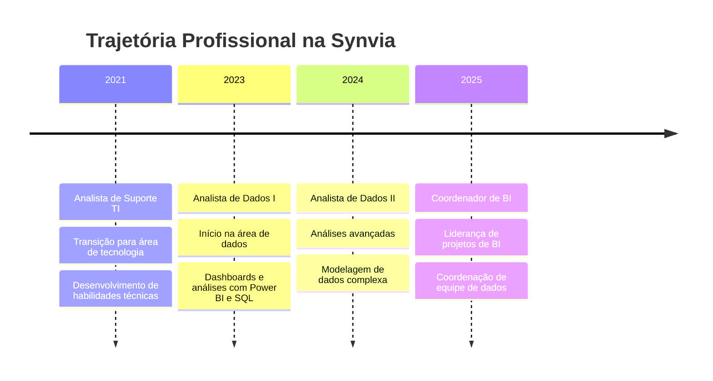
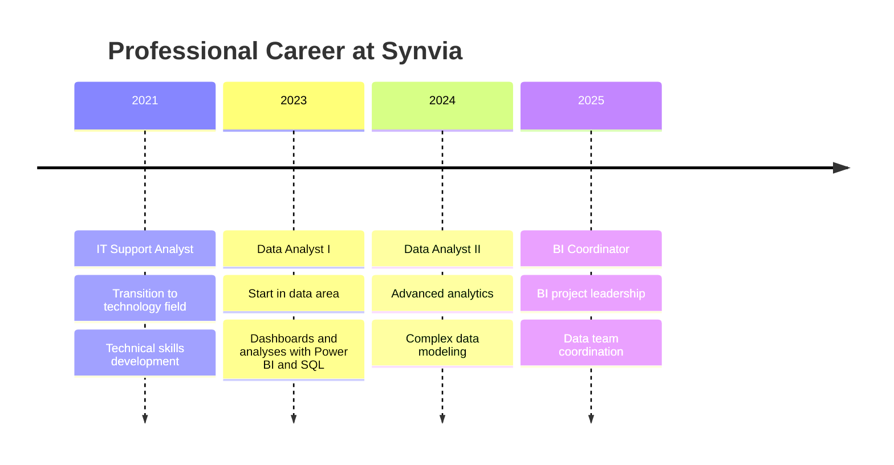

<div align="center">

<!-- Language Toggle -->
<a href="#-português">🇧🇷 Português</a> | <a href="#-english">🇺🇸 English</a>

<!-- Animated Header -->


<!-- Typing Animation -->
<a href="https://git.io/typing-svg"></a>

<br/>

<!-- Social Badges -->
<a href="https://www.linkedin.com/in/washington-gomes-7a4131b5/">
  
</a>
<a href="https://washingtongomes.vercel.app/">
  
</a>
<a href="mailto:washingtonsaoseba@gmail.com">
  
</a>

</div>

---

# 🇧🇷 Português

##  &nbsp;Sobre Mim


Sou um profissional apaixonado por **dados** e **tecnologia**, com experiência em transformar informações em insights estratégicos.

🎓 **Pós-graduado em Ciência de Dados**  
🎓 **Formado em Análise e Desenvolvimento de Sistemas**  
📍 **Caraguatatuba, São Paulo - Brasil**

Na **Synvia**, onde atuo há mais de **4 anos**, desenvolvo soluções analíticas com **SQL**, **DAX** e **Power BI** que orientam decisões críticas de negócios.

<br clear="both"/>

---

##  &nbsp;Minha Jornada


---

##  &nbsp;Tech Stack

<div align="center">

### 📊 Business Intelligence
<p>


</p>

### 🐍 Linguagens & Desenvolvimento
<p>


</p>

### 🗄️ Banco de Dados
<p>


</p>

### 🛠️ Ferramentas
<p>


</p>

</div>

---

##  &nbsp;Níveis de Habilidade
```text
Power BI          ████████████████████░░░░░   95%
DAX               ███████████████████░░░░░░   92%
Estratégia Dados  ██████████████████░░░░░░░   90%
SQL               ██████████████████░░░░░░░   90%
Looker Studio     █████████████████░░░░░░░░   88%
Tableau           █████████████████░░░░░░░░   85%
Python            █████████████████░░░░░░░░   85%
Machine Learning  ██████████████░░░░░░░░░░░   70%
```

---

##  &nbsp;Portfólio de Projetos 2025

<div align="center">

<table>
<tr>
<td align="center">

</td>
<td align="center">

</td>
<td align="center">

</td>
<td align="center">

</td>
<td align="center">

</td>
</tr>
</table>

</div>

### 📈 Dashboards
| Projeto | Área | Tecnologia | Impacto |
|---------|------|------------|---------|
| Dashboard de Contagem de Diferenças | Financeiro | Power BI | Auxílio no fechamento mensal |
| Dashboard de Agendamentos | Marketing | Power BI | Funcionalidade não nativa no sistema |

### ⚙️ Automações
| Projeto | Área | Tecnologia | Impacto |
|---------|------|------------|---------|
| Automação de Relatório de Amostras | Logística | Python | Redução de tempo na busca de amostras |
| Automações para Logística | Logística | Python | Previsibilidade de recebimento |
| Automação de Relatório de Erros | SAC | Python | Identificação proativa de erros |

### 💻 Sistemas
| Projeto | Área | Tecnologia | Impacto |
|---------|------|------------|---------|
| Sistema de Inspeção Mobile | Qualidade | Streamlit, Python | Digitalização com mobilidade |

---

# 🇺🇸 English

##  &nbsp;About Me


I'm a professional passionate about **data** and **technology**, with experience in transforming information into strategic insights.

🎓 **Postgraduate in Data Science**  
🎓 **Bachelor's in Systems Analysis and Development**  
📍 **Caraguatatuba, São Paulo - Brazil**

At **Synvia**, where I've been working for over **4 years**, I develop analytical solutions with **SQL**, **DAX**, and **Power BI** that guide critical business decisions.

<br clear="both"/>

---

##  &nbsp;My Journey


---

##  &nbsp;Tech Stack

<div align="center">

### 📊 Business Intelligence
<p>


</p>

### 🐍 Languages & Development
<p>


</p>

### 🗄️ Databases
<p>


</p>

### 🛠️ Tools
<p>


</p>

</div>

---

##  &nbsp;Skill Levels
```text
Power BI          ████████████████████░░░░░   95%
DAX               ███████████████████░░░░░░   92%
Data Strategy     ██████████████████░░░░░░░   90%
SQL               ██████████████████░░░░░░░   90%
Looker Studio     █████████████████░░░░░░░░   88%
Tableau           █████████████████░░░░░░░░   85%
Python            █████████████████░░░░░░░░   85%
Machine Learning  ██████████████░░░░░░░░░░░   70%
```

---

##  &nbsp;2025 Project Portfolio

<div align="center">

<table>
<tr>
<td align="center">

</td>
<td align="center">

</td>
<td align="center">

</td>
<td align="center">

</td>
<td align="center">

</td>
</tr>
</table>

</div>

### 📈 Dashboards
| Project | Area | Technology | Impact |
|---------|------|------------|--------|
| Difference Count Dashboard | Finance | Power BI | Monthly closing assistance |
| Scheduling Dashboard | Marketing | Power BI | Non-native system functionality |

### ⚙️ Automations
| Project | Area | Technology | Impact |
|---------|------|------------|--------|
| Sample Report Automation | Logistics | Python | Time reduction in sample search |
| Logistics Automations | Logistics | Python | Receiving predictability |
| Error Report Automation | Customer Service | Python | Proactive error identification |

### 💻 Systems
| Project | Area | Technology | Impact |
|---------|------|------------|--------|
| Mobile Inspection System | Quality | Streamlit, Python | Digitalization with mobility |

---

# 📊 &nbsp;GitHub Stats

<div align="center">

<a href="https://github.com/WashingtonGomesGouvea">
  
</a>

<a href="https://github.com/WashingtonGomesGouvea">
  
</a>
<a href="https://github.com/WashingtonGomesGouvea">
  
</a>

### 📅 Contribuições 2025 | 2025 Contributions


#### 📆 Contribuições por Mês | Monthly Contributions

<table>
<tr>
<td align="center"></td>
<td align="center"></td>
<td align="center"></td>
<td align="center"></td>
<td align="center"></td>
<td align="center"></td>
</tr>
<tr>
<td align="center"></td>
<td align="center"></td>
<td align="center"></td>
<td align="center"></td>
<td align="center"></td>
<td align="center"></td>
</tr>
</table>

<a href="https://github.com/WashingtonGomesGouvea">
  
</a>
<a href="https://github.com/WashingtonGomesGouvea">
  
</a>

</div>

---

##  &nbsp;Vamos Conversar? | Let's Talk?

<div align="center">

🇧🇷 Se você gostaria de discutir um projeto, oportunidade ou apenas trocar ideias sobre dados, estou sempre aberto para uma boa conversa!

🇺🇸 If you'd like to discuss a project, opportunity, or just exchange ideas about data, I'm always open for a good conversation!

<br/>

<a href="https://www.linkedin.com/in/washington-gomes-7a4131b5/" target="_blank">
  
</a>
<a href="https://github.com/WashingtonGomesGouvea" target="_blank">
  
</a>
<a href="mailto:washingtonsaoseba@gmail.com">
  
</a>
<a href="https://washingtongomes.vercel.app/" target="_blank">
  
</a>

</div>

---

<div align="center">

### 💡 *"Transformando dados em decisões estratégicas"*
### 💡 *"Transforming data into strategic decisions"*

<br/>


</div>

<!-- Animated Footer -->
